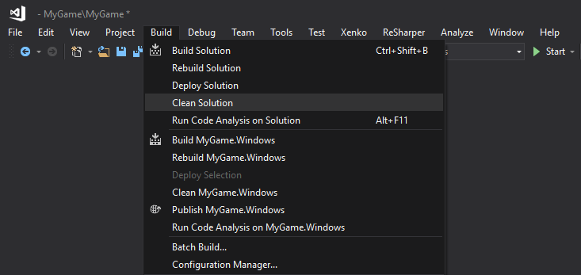
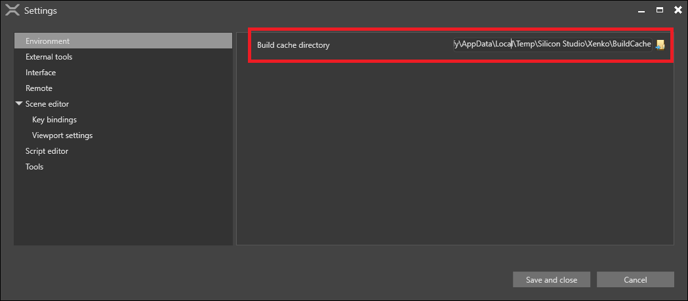
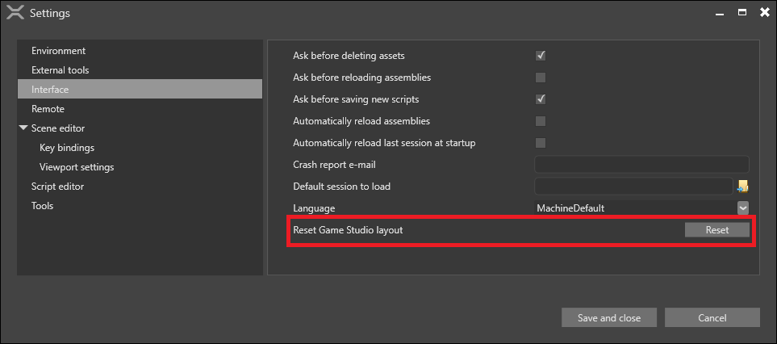

# Cached files

When you build your project, Xenko caches the assets and code in folders inside the project.

You might want to clean the cache if:

* the cache is taking up too much space on disk

* assets don't update in-game after you edit or delete them

## Clean the cache from Visual Studio

1. To clean the code cache, under **Build**, select **Clean Solution**.

    

2. If you have the [Xenko Visual Studio extension](../get-started/visual-studio-extension.md) installed, you can also clean the asset cache. To do this, under **Xenko**, select **Clean intermediate assets for Solution**.

    

3. Rebuild the project to rebuild the cache from scratch.

## Clean the cache manually

If cleaning the cache from Visual Studio doesn't work, try deleting the files manually.

1. Delete the following folders:

    * the binary cache: *~/MyGame/MyGame/Bin*

    * the asset cache: *~/MyGame/MyGame/Cache*

    * the **obj** folders in the platform folders for your game (eg *~/MyGame.iOS/obj*)

2. If you're developing for iOS, on your Mac, also delete: *~/Library/Caches/Xamarin/mtbs/builds/MyGame*

3. Rebuild the project to rebuild the cache from scratch.

## Clear the Game Studio caches

In addition to the caches Xenko creates for your project, Game Studio keeps caches for the editor.

### Asset cache

To speed up asset loading in the editor, Game Studio saves a cache of asset references. It contains data about every asset ever loaded in every project. This means it can grow very large over time.

By default, the folder is in: *%temp%/Silicon Studio/Xenko*

>[!Tip]
>To check or change where Game Studio saves the cache, see **Edit > Settings > Environment > Build cache directory.**
>

To clean the cache, delete the folder and run Game Studio again.

### Settings cache

Game Studio saves editor information (such as window positions and recently-opened projects) in: *%AppData%/Silicon Studio*

Game Studio also saves information about open tabs and the editor camera position in the `.xkpkg.user` file in the project folder (eg *~/MyGame/MyGame/MyGame.xkpkg.user*).

These files are small, but you might want to delete them if you get Game Studio into a bad state. Deleting them doesn't affect anything in your project.

After you delete cache files, when you start Game Studio, it builds a new cache using the default settings.

>[!Tip]
>You can also reset the Game Studio layout without clearing the cache in **Edit > Settings > Interface > Reset Game Studio layout**.
>

## See also

* [Project structure](project-structure.md)
* [Version control](version-control.md)