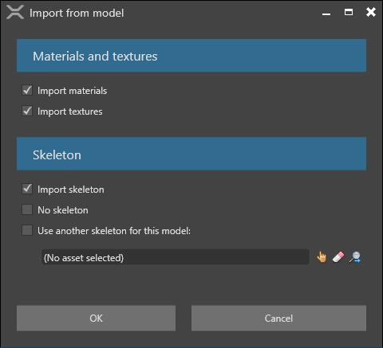
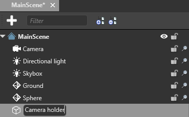
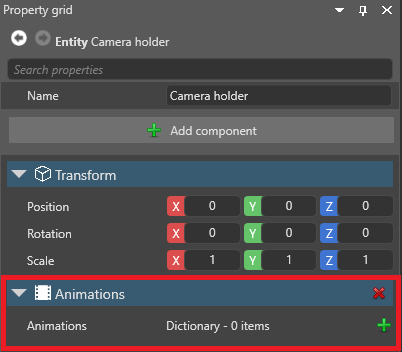
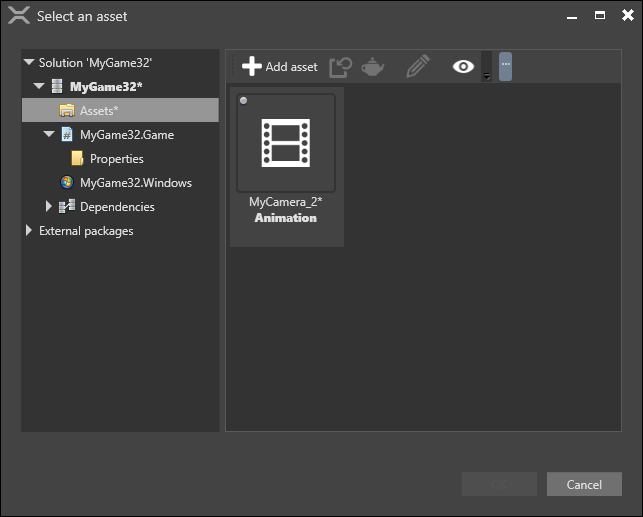
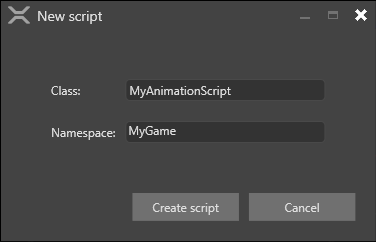
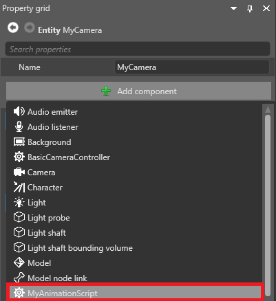
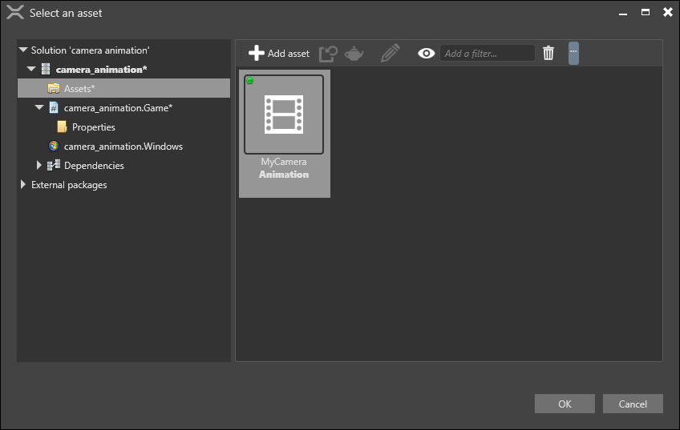
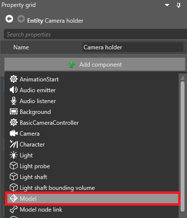
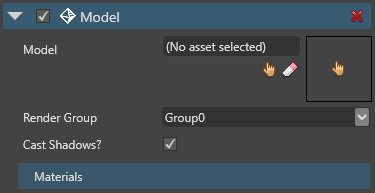
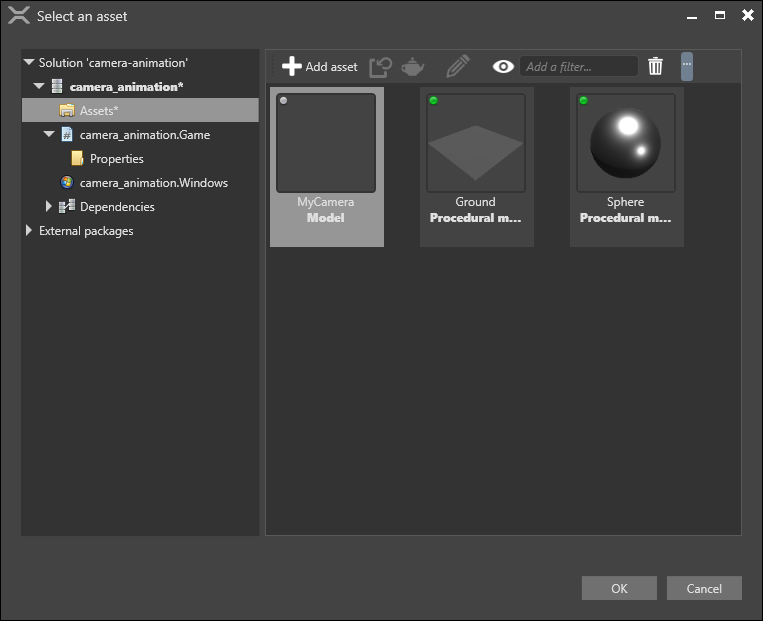

# Animate cameras with model files

Beginner
Artist

You can use model files such as `.fbx` or `.obj` to animate cameras at runtime.

>[!Note]
>To animate a camera using a model file, you first need to bake the animation using your modeling tool (eg Maya, 3ds Max or Blender).

>[TODO] Xenko doesn't support cameras animated using a target cameras.

## 1. Import the model file

Import the model, animation and skeleton from the model file. To do this: 

1. Drag the model file from Explorer to the **asset view** (in the bottom pane by default).

    * Alternatively, in the **asset view**: 

        1a. Click  and select **Import directly from files**.
    
        

        2b. Browse to the model file and click **Open**.

2. Select **3D model**.

    

    The **Import from model** dialog opens.

    

2. Make sure **Import skeleton** is selected and click **OK**.

    Game Studio imports the **model** and **skeleton** from the model file and adds them to the asset view.

    

3. Repeat step 1 to import the model file again. This time, select **Animation**.

    

    Game Studio imports the **animation clip** from the model file and adds it to the asset view.

    

## 2. Set up the entities

4. In the **scene editor**, create an entity to hold the camera you want to animate. To do this, right-click the scene, select **Empty entity**, and type a name.

    

    

5. Select the entity you created in the previous step. In the **property grid** on the right, click **Add component** and select **Animations**.

    

    Game Studio adds an animation component to the entity.

    

6. Next to **Animations**, click  (**Add...**) and type a name.

    

    Game Studio adds an animation to the list.

    

7. Next to the animation you added, click  (**Select an asset**).

    The **Select an asset** window opens.

    

8. Select the camera animation asset and click **OK**.

## 3. Set up the animation

9. Create a script to control the animation. To do this, in the **asset view**, click **Add asset** and select **Script > Animation start**.

    

    The **New script** window opens.

    

10. Type a name for the script and click **Create script**.

    If Game Studio asks if you want to save your script, click **Save script**.

    >[!Note]
    >For more information about animation scripts, see [Animation scripts](../../animation/animation-scripts.md).

11. Reload the assemblies.

    

12. Select the entity you created earlier. In the **property grid**, click **Add component** and select the animation script.

    

    Game Studio adds the script to the entity as a component.

13. Under the script component, next to **Animations**, click  (**Add...**).

    

14. Next to **Clip**, click  (**Select an asset**).

    The **Select an asset** window opens.

    

15. Select the camera animation and click **OK**.

16. Click **Add component** and select **Model**.

    

    Game Studio adds a model component to the entity.

    

17. Next to **Model**, click  (**Select an asset**)
    
    The **Select an asset** window opens. 

    

18. Select the camera model and click **OK**.

19. In the **entity tree**, drag the **camera entity** you want to animate to the entity you created. This makes the camera a child of the entity.

    

20. Select the camera entity.

21. In the **property grid**, click **Add component** and select **Model node link**.

    Game Studio adds a model link component to the entity. This component links the entity position to the node of a model.

22. In **Node name**, select the node you want to link to from the file.

    

    >[!Tip]
    >In **Target**, you can specify the entity to attach this entity to. If you leave this blank, the entity attaches itself to the parent entity.

At runtime, the camera animates according to the model file.

## See also

* [Animation](../../animation/index.md)
* [Animation scripts](../../animation/animation-scripts.md)