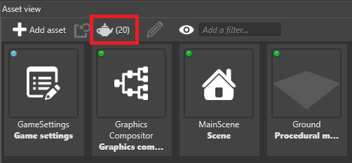
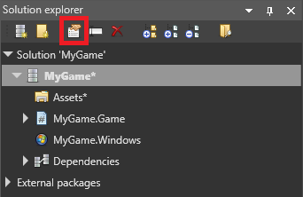

# Compile shaders

Beginner
Programmer

Xenko converts Xenko shaders (`xlsl` and `.xlfx` files) into the shader language used by the [graphics platform](../../platforms/set-the-graphics-platform.md).

| Platform       | Shader language 
| -------------- | ---- 
| Direct3D       | HLSL
| OpenGL         | GLSL
| Vulkan         | SPIR-V
| iOS            | OpenGL ES

Xenko can convert the shaders at runtime (when the game is running) or at build time (when the editor builds the game assets). When Xenko generates shaders at runtime, rendering stops until the shader is compiled. This is usually something you want to avoid in your release build — especially on mobile platforms, which have less CPU, so the pause can be more noticable.

## How Xenko converts shaders at runtime

Xenko can't know in advance which shaders will be used at runtime. This is because users might generate new shader permutations by, for example, changing material parameters or modifying post-effect parameters from scripts. Additionally, the final shaders depend on the graphics features on the execution platform.

1. When Xenko needs a new shader at runtime, it checks its database to see if the shader has already been converted. If the shader is in the database, Xenko uses it.

2. If the shader hasn't already been converted, Xenko compiles it — either locally (on the device) or remotely (in Game Studio), depending on the package **User Settings** (see below).

3. If **Record used effects** is enabled in the package **User Settings** (see below), Xenko notifies Game Studio that it needs a new shader.

4. Game Studio notifies you that there are new shaders to import.

    

    In the **Asset view**, the **Import effects** button becomes available.

    

5. If you click **Import effects**, Game Studio updates the **Effect Log** (or creates it if it doesn't exist) and adds them to the game database to be used the next time you build (see step 1).

    

## Change how Xenko compiles shaders

1. In Game Studio, in the **Solution explorer**, select the package and click **Package properties**.

    

2. In the **Property grid**, set the properties.

    

The **Effect compiler** property specifies how to compile the shader.

* **Local**: Convert the shader on the device. This is recommended for release versions of your game.

* **Remote**: Convert the shader on the developer machine. There's no reason to use this for release versions of your game, as it won't be able to connect to the developer machine.

* **LocalOrRemote**: Convert the shader on the developer machine; if this fails, try to convert it on the device. Like the **Remote** setting, this has no use for release versions of your game.

* **None**: Don't convert shaders. Note that the application will crash if it requires a shader that isn't in the database. Currently, using this feature doesn't save any space your application, so there's no advantage in using it. However, it might be useful for making sure you have every shader in the database; if the game crashes, you know the database is missing at least one shader.

If you enable **Record used effects**, Game Studio adds new shaders to the Effect Log as soon as they're needed. We recommend you disable this for release versions of your game, as it can't connect to the developer machine.

## Compile shaders remotely when developing for iOS

As iOS devices can't connect directly to PC, to convert Xenko shaders remotely when developing for iOS, you need to use a Python script as a relay between the device, a Mac, and the developer PC.

1. Make sure your PC and Mac are connected to the same network.

2. On your Mac, install Python. You can download Python from the [Python site](https://www.python.org/downloads/).

3. Download and unzip [ios-tcreplay.zip](media/ios-tcprelay.zip).

4. Open **Terminal**, navigate to the folder where you unzipped the file, and execute **xenko-ios-relay.py MyPcName**, where **MyPcName** is the name of your developer PC.

    >[!Tip]
    >To find the name of your developer PC, on the PC, press the Windows key, type **About**, and press **Enter**. The PC name is listed under **PC name**.

The iOS device should now be able to communicate with the PC via your Mac to build shaders remotely.

## Error messages

If your application tries to connect to Game Studio to compile a shader or to notify Game Studio that it needs new shaders, but can't connect, the Visual Studio output displays this error:

"[RouterClient]: Error: Could not connect to connection router using mode Connect. System.AggregateException: One or more errors occurred. ---> System.Net.Sockets.SocketException: No connection could be made because the target machine actively refused it 127.0.0.1:31254"