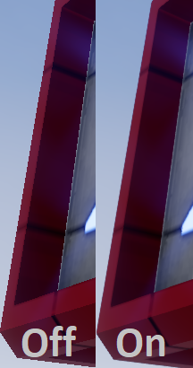

# Anti-aliasing

**Anti-aliasing** smooths jagged edges. For post-processing, Xenko uses fast-approximate anti-aliasing (FXAA), a single-pass screen-space technique with low performance impact.

>[!Note]
>Currently, the anti-aliasing post-effect doesn't work correctly on Android devices.

Xenko also includes **MSAA** (multisample anti-aliasing), but this isn't a post effect. You can enable MSAA in the **forward renderer** properties.

## Properties

| Property          | Description 
| --------------    | ---- 
| Dither            | The amount of dither. Less dither produces better results, but is slower.
| Quality           | The quality of the effect. This directly affects performance.
| Input luminance from alpha | Retrieve the luminance from the alpha channel of the input color. This is slower but more accurate. If disabled, the effect uses the green component of the input color as an approximation for the luminance.

## See also

* [Ambient occlusion](ambient-occlusion.md)
* [Bloom](bloom.md)
* [Bright filter](bright-filter.md)
* [Color transforms](color-transforms/index.md)
* [Depth of field](depth-of-field.md)
* [Lens flare](lens-flare.md)
* [Light streaks](light-streaks.md)