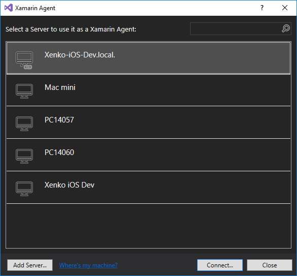
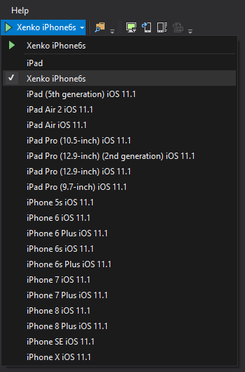
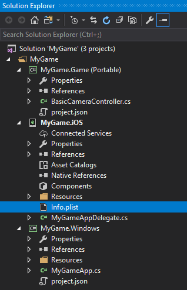
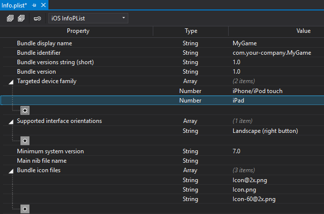
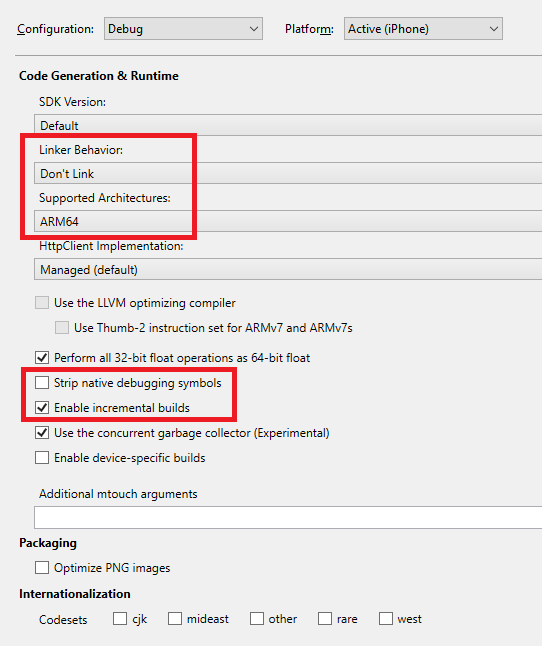

# iOS

To deploy your game on iOS devices, you need to connect the device to a Mac with Xamarin.

1. Make sure Xamarin is installed on the PC and the Mac. For instructions about how to install and set up Xamarin, see the Xamarin documentation:

    * [Installing Xamarin in Visual Studio on Windows](https://developer.xamarin.com/guides/cross-platform/getting_started/installation/windows/)

    * [Connecting to Mac](https://developer.xamarin.com/guides/ios/getting_started/installation/windows/connecting-to-mac/)

2. Make sure your iOS device is provisioned. For instructions, see [Device provisioning](https://developer.xamarin.com/guides/ios/getting_started/installation/device_provisioning/) in the Xamarin documentation.

3. Make sure the iOS platform is added to your Xenko project. To do this, in Game Studio, right-click the solution, select **Update package > Update Platforms**, and make sure **iOS** is selected.

    

    For more information about adding platforms in Game Studio, see [Add or remove a platform](add-or-remove-a-platform.md).

4. Open your solution in Visual Studio.

    >[!Tip]
    >To open your project in Visual Studio from Game Studio, in the Game Studio toolbar, click  (**Open in IDE**).

5. In the Visual Studio toolbar, click .

    

     **Xamarin Agent** opens.

    

6. Connect to the Mac via Xamarin. For instructions, see [Introduction to Xamarin iOS for Visual Studio](https://developer.xamarin.com/guides/ios/getting_started/installation/windows/introduction_to_xamarin_ios_for_visual_studio/) in the Xamarin documentation.

7. In the **Solution Explorer**, right-click the project and select **Set as StartUp Project**.

    

8. In the **Solution Platforms** menu, select **iPhone** to build on physical iOS devices (including iPad), or **iPhoneSimulator** to build for the simulator. The simulator emulates iOS devices on your machine, but has some drawbacks (see below).

    
 
9. In the Visual Studio toolbar, select the iOs device you want to build for.

    
 
10. From the **Solution Explorer**, open `info.plist`.

    

11. If you want to create a release build, set the **bundle identifier**. This is a unique ID for your application.

    

12. If you want to deploy on iPad, under **Targeted device family**, click .

    

## Speed up builds on iOS devices

It takes a long time to build on iOS devices. This is because:

* the Mac needs to build code ahead of time (AOT) for the different devices

* the Apple sandbox system doesn't let you update packages incrementally, so the Mac needs to completely redeploy the application on the device for every change

To compile code more quickly, in the Solution Explorer, right-click the iOS project and select **Properties**.

* Under **Linker Behavior**, select **Don't link**.
* Under **Supported Architectures**, select only the architecture of the debug device.
* Disable **Strip native debugging symbols**.
* Enable **incremental builds** (only code that changes from one execution to another is AOT)

For more information, see [iOS Build Mechanics](https://developer.xamarin.com/guides/ios/advanced_topics/ios-build-mechanics/) in the Xamarin documentation. For information about profiling, see [Using instruments to detect native leaks using markheap]( 
https://developer.xamarin.com/guides/ios/deployment,_testing,_and_metrics/using_instruments_to_detect_native_leaks_using_markheap).

To make redeploying each time faster, make your debug packages as small as possible.

* In Game Studio, reduce the **Size** of the [textures](../graphics/textures/index.md) in your project.

* Remove unused assets.

* Test your scenes one by one rather than loading them simultaneously.

* Debug your application on the **iPhone simulator** instead of a real device. However, execution is slow on the simulator and it produces some rendering artifacts, so we don't recommend using it to debug real-time graphics.

## Compile shaders on iOS

As converting Xenko shaders to OpenGL shaders on iPhone devices is slow, we recommend you convert them remotely (ie in Game Studio).

Our recommended workflow is:

1. Execute the app on Windows. This creates the shader permutations.

    

2. Import the new shaders in Game Studio. This generates an effect log.

    

3. Save and run the game on iOS.

Ideally, this creates all the shader permutations remotely, so you don't need to convert them on the device. However, new permutations might still occur due to differences such as supported screen resolutions. For more information, including information about how to compile shaders remotely on iOS, see [Compile shaders](../graphics/effects-and-shaders/compile-shaders.md).

## See also

* [iOs in the Xamarin documentation](https://developer.xamarin.com/guides/ios/)
* [Compile shaders](../graphics/effects-and-shaders/compile-shaders.md)