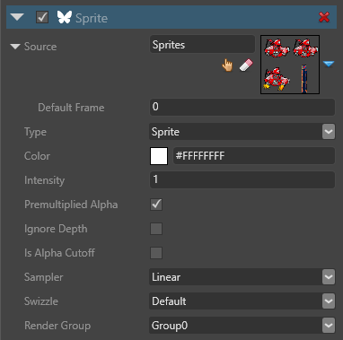

# Use sprites

<span class="label label-doc-level">Intermediate</span>
<span class="label label-doc-audience">Programmer</span>

To add a sprite to a scene, add a **sprite component** to an entity. Afterwards, you can control the sprite with a script.

## Add a sprite component

1. In the **Scene Editor**, select the entity you want to add a sprite to.

    >[!Tip]
    >To create an entity, right-click the scene or entity tree and select **Empty entity**.

2. In the **property grid**, click **Add component** and select **Sprite**.

    

    Game Studio adds a Sprite component to the entity.

3. From the **asset view**, drag the sprite sheet to the **Source** field in the Sprite component:

    <p>
        <video autoplay loop class="responsive-video" poster="media\drag-sprite-sheet-to-asset-picker.png">
        <source src="media\drag-sprite-sheet-to-asset-picker.mp4" type="video/mp4">
        </video>
    </p>

    Alternatively, click  (**Select an asset**):

    

    Then choose a sprite sheet:

    

Game Studio adds the sprite to the entity.

### Sprite component properties

You can access the sprite component properties in the **property grid**.



| Property   | Function    
|------------|-----------
| Source | The source image file for the sprite
| Type | **Sprites** have 3D space in the scene. <br>**Billboards** always face the camera and appear fixed in 3D space.
| Color | Applies a color to the sprite
| Intensity | The intensity by which the color is scaled (mainly used for rendering LDR sprites in HDR scenes)
| Premultiply alpha | Premultiply color components by their alpha component
| Ignore depth | Ignore the depth of other elements in the scene when rendering the sprite. This always places the sprite on top of previous elements. 
| Alpha cutoff | Ignore pixels with low alpha values when rendering the sprite
| Sampler | The texture sampling method used for the sprite: Point (nearest), Linear, or Anisotropic
| Swizzle | How the color channels are accessed. <br>**Default** leaves the image unchanged (finalRGB = originalRGB) <br>**Normal map** uses the color channels as a [normal map](../graphics/textures/normal-maps.md) <br>**Grayscale (alpha)** uses only the R channel (finalRGBA = originalRRRR), so the sprite is red <br>**Grayscale (opaque)** is the same as **Grayscale (alpha)**, but uses a value of `1` for the alpha channel, so the sprite is opaque
| Render group | Which render group the sprite belongs to. Cameras can render different groups. For more information, see [Render groups and render masks](render-groups-and-masks.md).

## Use sprites in a script

You can use scripts to render sprites at runtime. To do this, attach the script to an entity with a sprite component.

For information about how to add scripts to entities, see [Use a script](../scripts/use-a-script.md).

### Code sample

This script displays a sprite that advances to the next sprite in the index every second. After it reaches the end of the sprite index, it loops.

```cs
using SiliconStudio.Xenko.Rendering.Sprites;

public class Animation : SyncScript
{
   // Declared public member fields and properties are displayed in Game Studio.
   private SpriteFromSheet sprite;
   private DateTime lastFrame;

   public override void Start()
   {
       // Initialize the script.
       sprite = Entity.Get<SpriteComponent>().SpriteProvider as SpriteFromSheet;
       lastFrame = DateTime.Now;
   }

   public override void Update()
   {
      // Do something every new frame.
      if ((DateTime.Now - lastFrame) > new TimeSpan(0, 0, 1))
      {
         sprite.CurrentFrame += 1;
         lastFrame = DateTime.Now;
      }
   }
}
```

## See also

* [Import sprite sheets](import-sprite-sheets.md)
* [Edit sprites](edit-sprites.md)