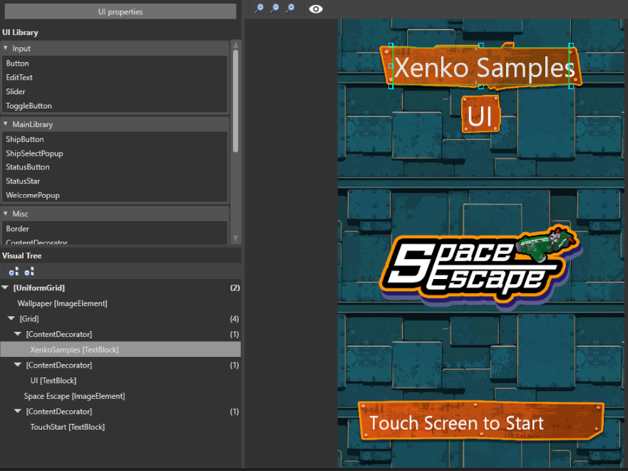
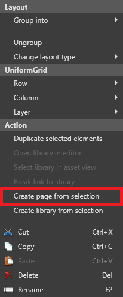
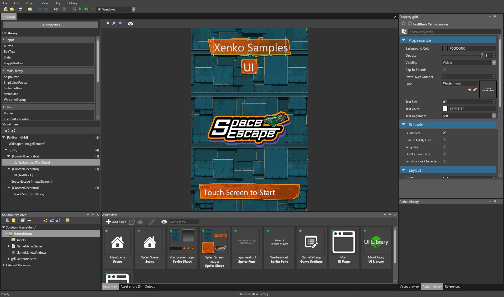
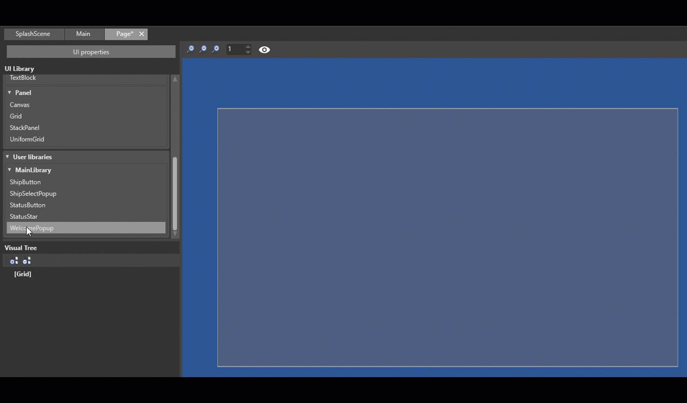

# UI pages

Beginner
Artist
Designer

A **UI page** is a collection of UI elements, such as buttons and grids, that form a piece of UI in your game, such as a menu or title screen.

In terms of organization, a UI page is equivalent to a scene in the scene editor, and UI elements are equivalent to entities in a scene. Just like entities, elements can have parents and children.

Each UI scene opens in its own tab in the UI editor. For information about how to edit UI pages, see the [UI editor](ui-editor.md) page.

## Create a UI page

In the **asset view**, click **Add asset > UI > UI page**.

Game Studio adds the UI page to the asset view.

### Create a UI page from a UI element

1. In the UI editor, select the element or elements you want to create a page from.

2. Right-click and select **Create page from selection**.

Game Studio creates a page with a copy of the elements you selected.

## Open a UI page

In the **asset view**, double-click the **UI page**.

The UI page opens in the [UI editor](ui-editor.md).

## Add a UI element to a UI page

To add an element, such as a grid or button, drag it from the **UI library** to the UI page or the **visual tree**.

For more information about how to use the UI editor, see the [UI editor](ui-editor.md) page.

## See also

* [UI libraries](ui-libraries.md)
* [UI editor](ui-editor.md)
* [Add a UI to a scene](add-a-ui-to-a-scene.md)
* [Layout system](layout-system.md)